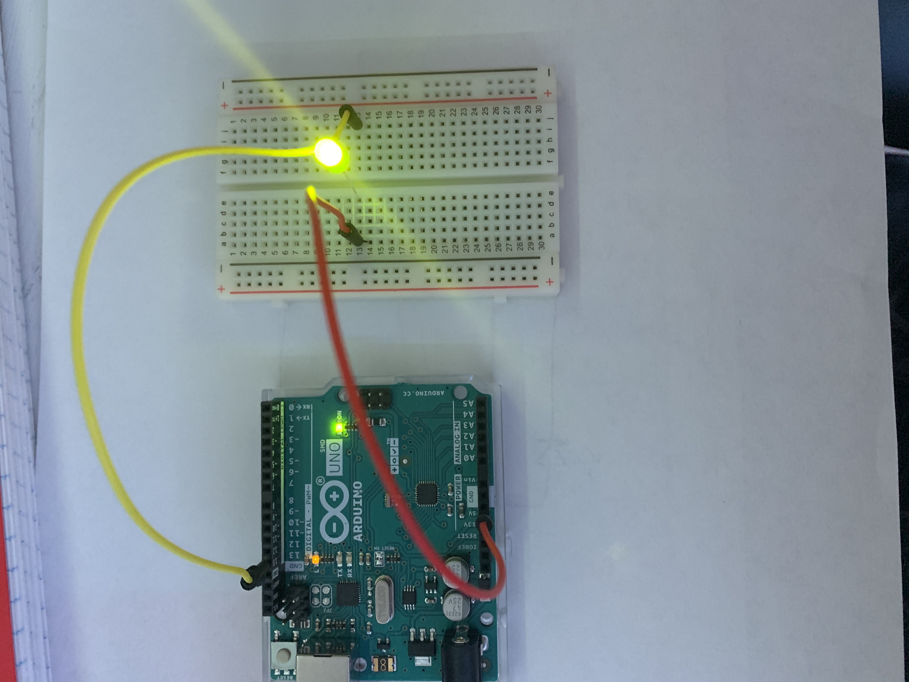
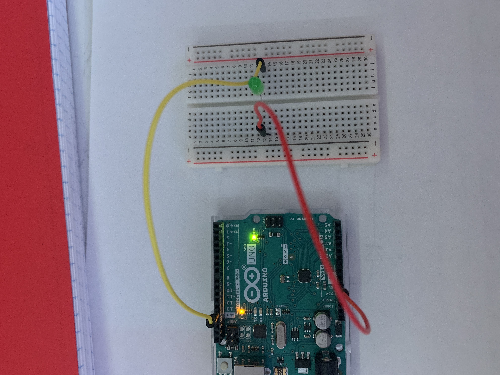
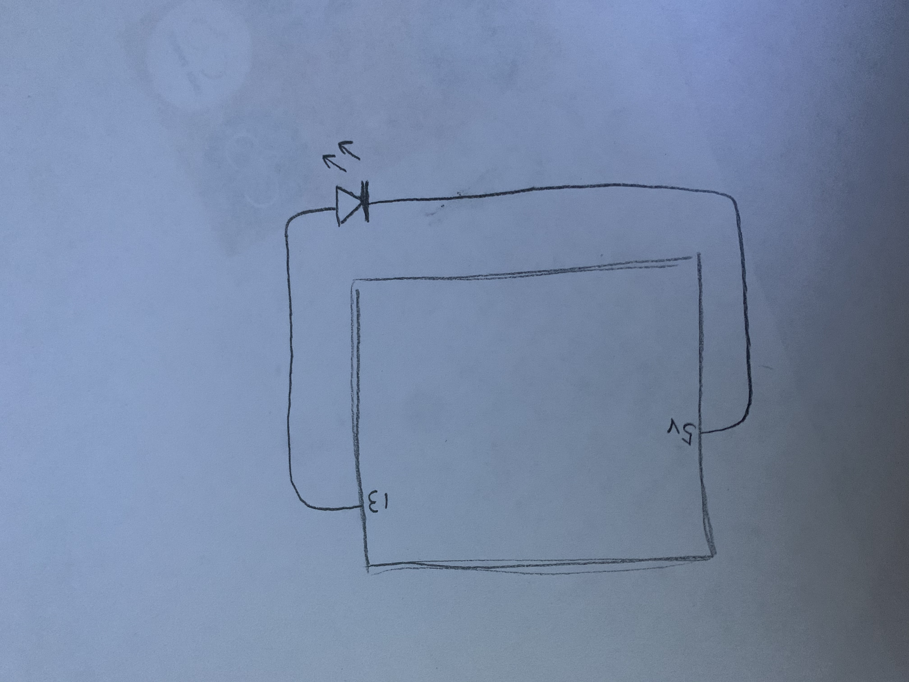

Sources:
  https://www.arduino.cc/reference/en/
  https://forum.arduino.cc/
  
  
Difficulties:
  .I figured out the code pretty fast because it wasn't that advanced
  but the whole setup of arduino took me a while because I wasn't sure
  where everything was suppose to go.
  .I tried to do analogRead and digitalRead but I couldn't get it to work
  
What is happening:
  In the photos I took, when the green button is flashing, the L (led button)
  on arduino isn't, then vis versa after one second intervals.
  
   
   
   
   
   
    

