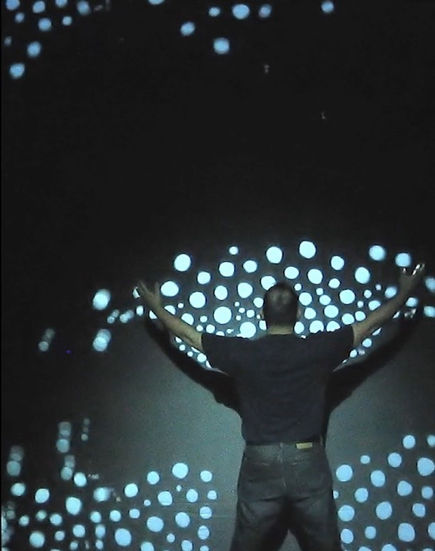

Project Description:
My project is basically a proximal detector that senses when your hand is near and at differnt lengths, different LED lights are activated
along with different tunes from a buzzer. I was inspired from Golan Levin's art pieces and I wanted to make a more simplistic version of his audio-
visual pieces but I didnt have a sound senor so I made a more mix of all his pieces in a simple way by taking inspiration from his piece "Footfalls" 
which uses proximal detectors like mine and I wanted to use something like his audiosensory pieces so I included the buzzer to play different tunes
because his audio to visual or visual to audio pieces are the ones I admired the most.

